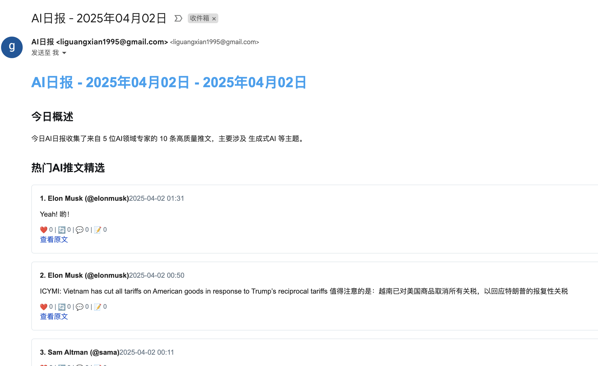
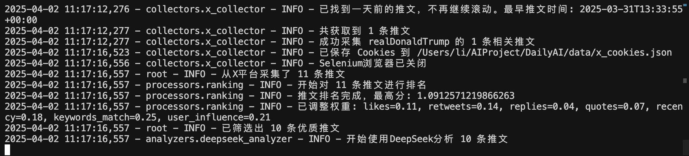

# 每日 AI 资讯采集与分发系统

这是一个自动化的 AI 领域资讯采集与分发系统，能够从 X（Twitter）平台收集 AI 专家的最新推文，并通过邮件发送日报。

## 功能特点

- **自动化采集**：从 X 平台采集指定账号的最新推文
- **智能筛选**：基于关键词和时间筛选相关内容
- **远程调试**：支持使用已登录的 Chrome 浏览器会话采集数据
- **日报分发**：将筛选后的内容以邮件形式分发给订阅者

## 运行截图



## 系统要求

- Python 3.8+
- Chrome 浏览器
- ChromeDriver (与 Chrome 版本匹配)

## 快速开始

### 安装依赖

1. 克隆代码库后，创建并激活虚拟环境：

```bash
python -m venv .venv
source .venv/bin/activate  # Linux/Mac
# 或 .venv\Scripts\activate  # Windows
```

2. 安装依赖：

```bash
pip install -r requirements.txt
```

### 配置文件

1. 复制配置文件模板：

```bash
cp config/accounts.yaml.example config/accounts.yaml
cp config/collector.yaml.example config/collector.yaml
cp config/smtp.yaml.example config/smtp.yaml
```

2. 编辑 `config/accounts.yaml` 文件，添加要监控的 X 账号：

```yaml
accounts:
  - username: "openai"
    full_name: "OpenAI"
    keywords: ["GPT", "AI", "model"]
  - username: "Google_AI"
    full_name: "Google AI"
    keywords: ["LLM", "DeepMind"]
```

3. 编辑 `config/collector.yaml` 设置采集参数：

```yaml
# 采集配置
collector:
  platforms: ["x"]  # 目前支持 x 平台
  max_items: 50     # 每个账号最多采集的内容数量
  start_days: 1     # 采集最近几天的内容
  
  # 通用关键词，任一关键词匹配即视为相关
  keywords:
    - "AI"
    - "ML"
    - "机器学习"
    - "大模型"
    - "LLM"
```

4. 编辑 `config/smtp.yaml` 配置邮件发送参数：

```yaml
# SMTP配置
smtp:
  server: "smtp.example.com"
  port: 587
  username: "your-email@example.com"
  password: "your-password"
  sender: "AI日报 <your-email@example.com>"
  use_tls: true
  timeout: 30

# 邮件发送配置
email:
  subject_template: "AI日报 - {date}"
  recipients:
    - "subscriber1@example.com"
    - "subscriber2@example.com"
```

### 运行系统

#### 方法一：使用远程调试模式

1. 启动 Chrome 远程调试模式：

```bash
chmod +x tools/start_chrome_debug.sh  # 仅首次运行需要
./tools/start_chrome_debug.sh
```

2. 在打开的 Chrome 窗口中手动登录 X 账号，保持窗口打开

3. 运行采集程序：

```bash
python main.py
```

#### 方法二：使用 Cookies 方式

1. 在 Chrome 中登录 X 账号
2. 安装 Chrome 扩展 "EditThisCookie"
3. 访问 Twitter 网站
4. 点击 EditThisCookie 扩展图标，导出 Cookies
5. 将导出的 JSON 内容保存到 `data/x_cookies.json`
6. 运行采集程序：

```bash
python main.py
```

## 清理文件

系统运行过程中会生成以下临时文件，可以根据需要删除：

- **data/x_cookies.json**: 保存的 X 平台 Cookies，如果不再使用可以删除
- **logs/**: 日志文件，可以定期清理
- **.venv/**: Python 虚拟环境，重新安装时可以删除

## 注意事项

1. **Chrome 远程调试**：使用远程调试模式时，必须保持 Chrome 窗口打开，直到采集完成
2. **Cookies 过期**：X 平台的 Cookies 可能会定期过期，过期后需要重新导出
3. **调试模式**：如果采集失败，可以在 `collector.yaml` 中设置 `debug: true` 获取更详细的日志
4. **采集频率**：建议适当控制采集频率，避免被平台限制

## 故障排除

1. **Chrome 初始化失败**：确保安装了 Chrome 浏览器，并且 ChromeDriver 版本与 Chrome 版本匹配
2. **远程调试连接失败**：检查 Chrome 是否以远程调试模式启动，默认端口为 9222
3. **无法获取推文**：检查账号是否存在，以及是否有最近 24 小时内的推文
4. **邮件发送失败**：检查 SMTP 配置是否正确，以及网络连接是否稳定

## 贡献指南

欢迎提交 Pull Request 或 Issue 来改进这个项目！提交前请确保代码经过测试。